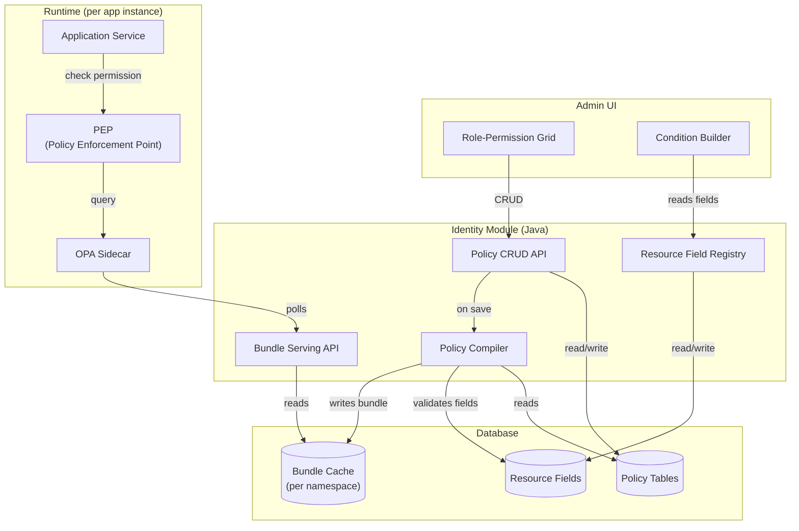
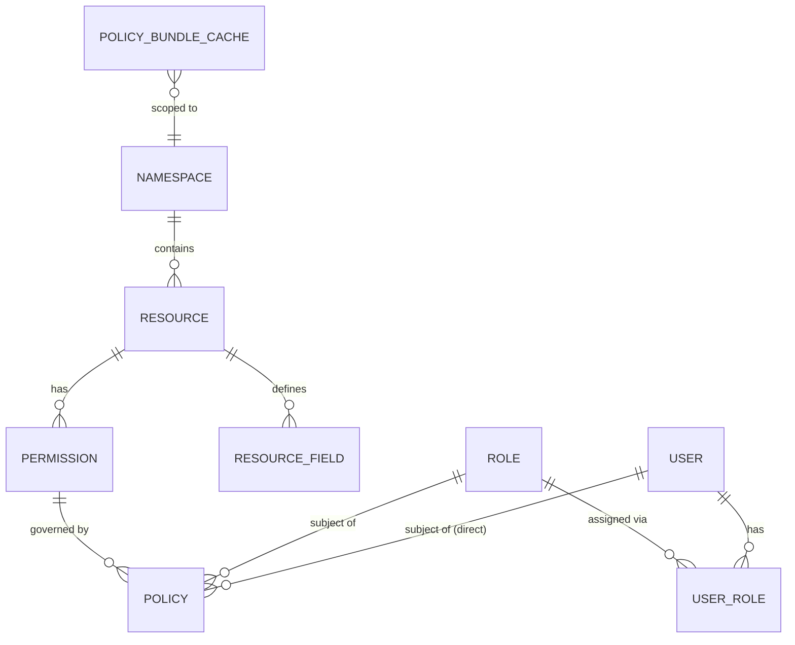

# Dynamic Policy-Based Authorization using OPA

## Goal
Transition from static **Role → Permission** mappings to dynamic, business-rule-based **Policies**, keeping **OPA (Open Policy Agent)** as the Policy Decision Point (PDP) while managing rules entirely via a UI.

---

## High-Level Architecture

---

## Core Concepts

The system is built on a **resource hierarchy** that defines _what_ is being protected, and a **policy layer** that defines _who_ can access it and _when_.

### How They Work Together

1. A **Namespace** groups related contexts (e.g., `finance`, `clinical`).
2. A **Resource** lives in a namespace and represents a specific entity (e.g., `journal`).
3. A **Resource Field** defines attributes of a resource that can be used in policy conditions (e.g., `amount`, `bank`).
4. A **Permission** lives on a resource and represents a specific action (e.g., `create`). Auto-generates a code like `finance:journal:create`.

> **Note on Registration:** To completely decouple teams, Namespaces, Resources, Permissions, and Resource Fields are **all 100% auto-registered on startup** via reflection on Application Commands. There are NO migration scripts required from the application teams.
5. A **Role** is a standard role definition. Users are assigned to roles via the **User Role** table.
6. A **Policy** ties a Permission to a Subject (Role or User) and adds dynamic conditions. **The policy table IS the role-to-permission mapping** — no separate mapping table is needed.

### Entity Relationship Diagram

---

## Key Design Decisions

| Decision | Rationale |
|---|---|
| **Policy table = role-permission mapping** | No separate `role_permission` table. Every permission assignment is a policy, optionally enriched with conditions. |
| **JSON AST for conditions** | Normalized DB tables for nested AND/OR groups are overly complex. JSON maps perfectly to UI rule builders. |
| **Per-namespace bundles** | Each namespace gets its own `bundle.tar.gz`. Enables granular regeneration and prepares for microservice split. |
| **100% Auto-Registration** | `@PolicyResource` and `@PolicyField` annotations on application commands auto-register Namespaces, Resources, Permissions, and Fields with the identity module on startup. Zero migration scripts required from application teams. |
| **DENY overrides ALLOW** | Any matching DENY policy blocks access regardless of ALLOW policies. Enforced via `not deny_rule` in Rego. |
| **On-demand bundle regeneration** | Bundle is recompiled synchronously when admin saves policy changes. No event-driven complexity. |
| **One OPA per app instance** | Same topology for modulith and microservices. |
| **Soft deletes on all entities** | All tables use `deleted_at` timestamp. `NULL` = active. |

---

## Document Index

| Document | Contents |
|---|---|
| [02-database-schema.md](file:///Users/apple/Documents/opa_integration_backend/02-database-schema.md) | All table schemas with column definitions and examples |
| [03-policy-engine.md](file:///Users/apple/Documents/opa_integration_backend/03-policy-engine.md) | Condition engine, conflict resolution, field registry, deprecation handling |
| [04-opa-integration.md](file:///Users/apple/Documents/opa_integration_backend/04-opa-integration.md) | Compiler pipeline, Rego generation, bundle management, OPA deployment, input contract |
| [05-admin-ui-workflow.md](file:///Users/apple/Documents/opa_integration_backend/05-admin-ui-workflow.md) | Role-permission grid, condition builder, deprecated field warnings |
