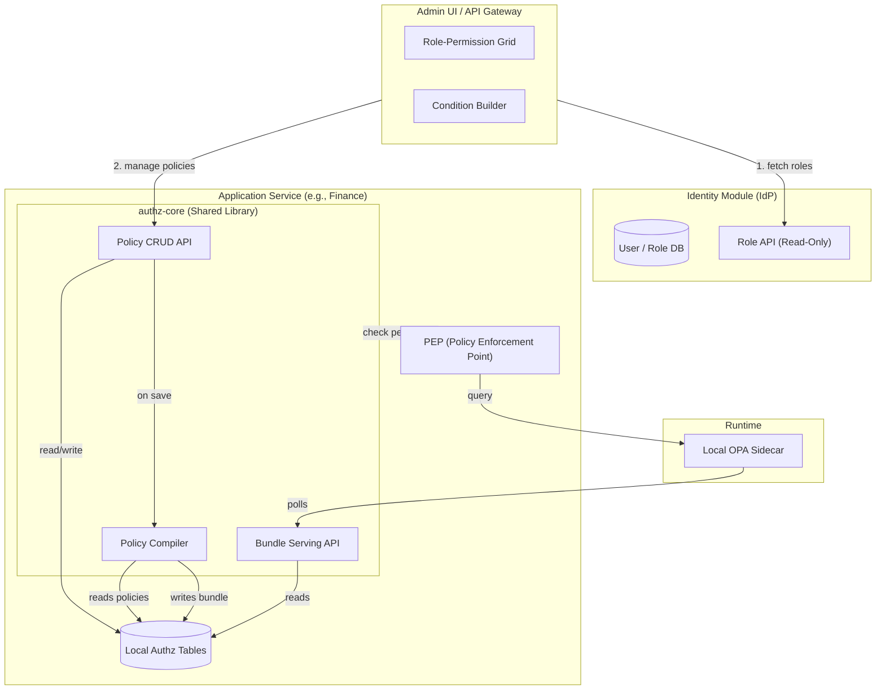
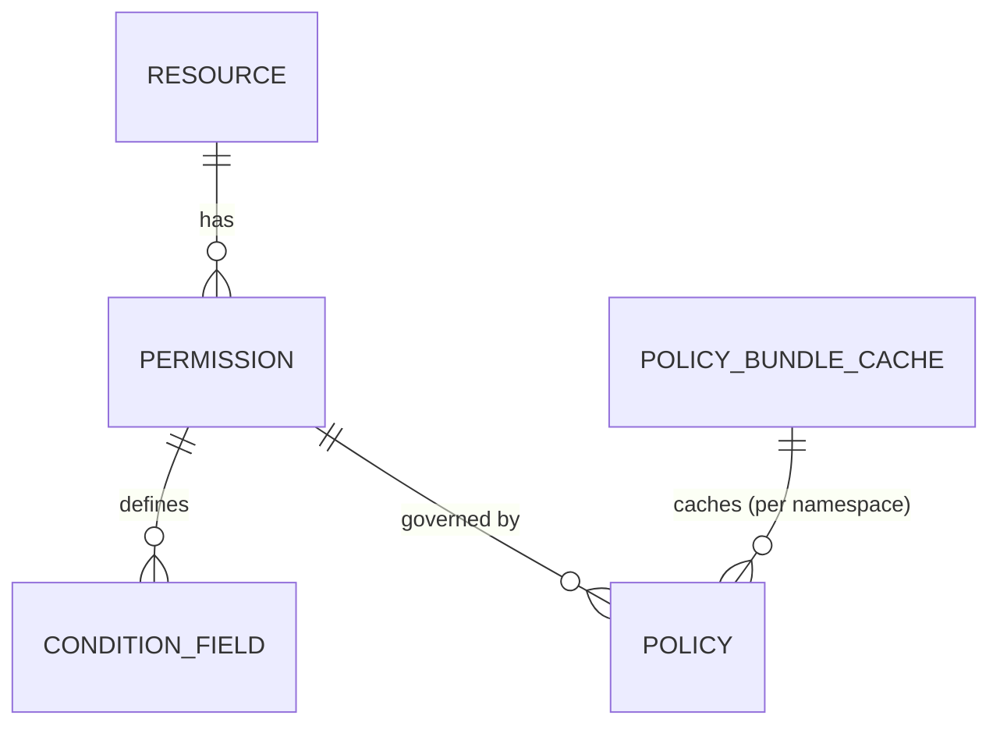

# Federated Policy-Based Authorization using OPA

## Goal
Transition from static **Role → Permission** mappings to dynamic, business-rule-based **Policies**, keeping **OPA (Open Policy Agent)** as the Policy Decision Point (PDP). 
To ensure true microservice scalability and loose coupling, this architecture uses a **Federated Authorization Library** model, where the Identity module acts strictly as an Identity Provider, and each application service manages its own authorization state.

---

## High-Level Architecture (Federated Model)

---

## Core Concepts

The system is built on a **Federated Library** that encapsulates authorization logic. It is embedded in every application module/microservice.

### How They Work Together

1. **Identity Provider:** The central Identity module only manages Users, standard Roles (e.g., `ACCOUNTANT`), and User-Role assignments.
2. **Shared Library (`authz-core`):** A reusable dependency injected into application services. It provisions local database tables and exposes standard REST APIs for the Admin UI and OPA.
3. **Local Resources:** An application service defines its own **Resources** (grouped by a `namespace` for bounded context), **Permissions**, and **Condition Fields** via annotations on its Commands.
4. **Local Auto-Registration:** At startup, the `authz-core` library scans the local application for annotations and upserts them into its **local** database schema. No central sync is required.
5. **Local Policies:** A **Policy** ties a local Permission to a standard Role and adds dynamic conditions. The `authz-core` library compiles these policies into Rego and serves the bundle to the local OPA sidecar.

### Entity Relationship Diagram (per Application Database)

*(Note: Roles and Users are managed externally in the Identity Provider, so the local Policy table simply stores the `role_name` or `user_id` as a reference).*

---

## Key Design Decisions

| Decision | Rationale |
|---|---|
| **Federated Library Model** | The Identity module does not own policies. Each application manages its own authz state via the `authz-core` library, ensuring perfect loose coupling and zero central bottlenecks. |
| **100% Local Auto-Registration** | `@PolicyResource` and `@PolicyField` annotations on application commands auto-register Resources, Permissions, and Fields into the *local* database on startup. |
| **JSON AST for conditions** | Normalized DB tables for nested AND/OR groups are overly complex. JSON maps perfectly to UI rule builders. |
| **DENY overrides ALLOW** | Any matching DENY policy blocks access regardless of ALLOW policies. Enforced via `not deny_rule` in Rego. |
| **Local OPA Bundle Cache** | The `authz-core` library compiles Rego and stores zipped bundles *per namespace* in the local database, serving them directly to the local OPA sidecar. |
| **Soft deletes on all entities** | All tables use `deleted_at` timestamp. `NULL` = active. |

---

## Document Index

| Document | Contents |
|---|---|
| [02-database-schema.md](file:///Users/apple/Documents/opa_integration_backend/02-database-schema.md) | Identity Schema vs. Library Schema with column definitions |
| [03-policy-engine.md](file:///Users/apple/Documents/opa_integration_backend/03-policy-engine.md) | Condition engine, local field registry, local deprecation handling |
| [04-opa-integration.md](file:///Users/apple/Documents/opa_integration_backend/04-opa-integration.md) | Local compiler pipeline, Rego generation, OPA deployment |
| [05-admin-ui-workflow.md](file:///Users/apple/Documents/opa_integration_backend/05-admin-ui-workflow.md) | Modular Role-permission grid, condition builder |
| [06-api-endpoints.md](file:///Users/apple/Documents/opa_integration_backend/06-api-endpoints.md) | REST APIs exposed by the authz-core library |
