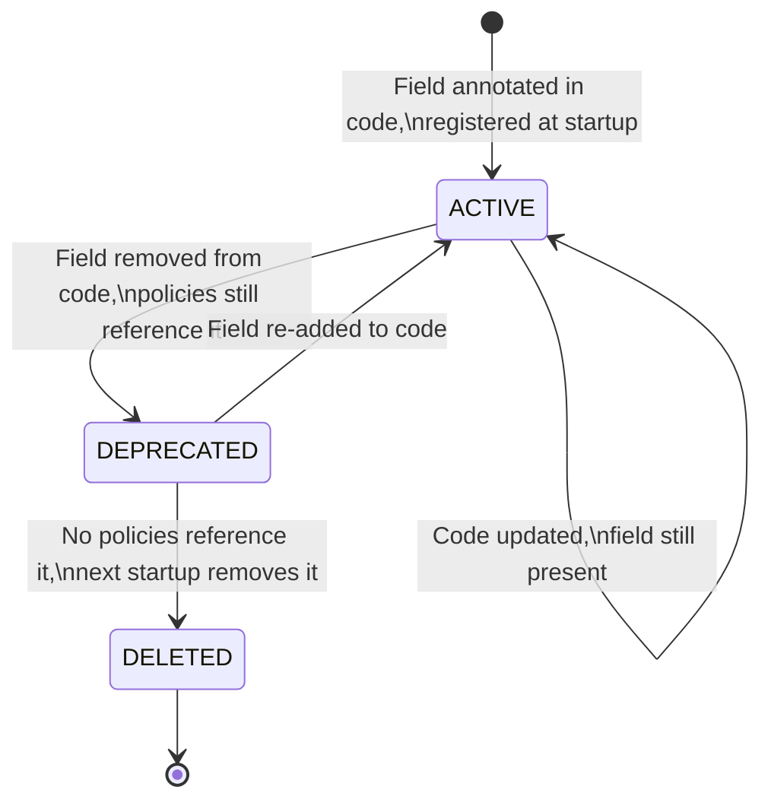

# Policy Engine

This document covers the condition engine, conflict resolution rules, the resource field registry, and field deprecation handling.

---

## 1. Condition Engine — JSON AST

Policies often require complex, nested conditions (e.g., `(A AND B) OR (C AND D)`). Creating normalized database tables for unlimited nested AND/OR groups is overly complex.

Instead, the UI condition builder saves the entire condition tree as an **Abstract Syntax Tree (AST)** in the `expression_json` column of the `policy` table.

### Simple Condition

```json
{
  "operator": "AND",
  "children": [
    { "field": "resource.amount", "comparison": "<=", "value": 10000 },
    { "field": "resource.bank", "comparison": "!=", "value": "CASH" }
  ]
}
```

### Nested Conditions

```json
{
  "operator": "OR",
  "children": [
    {
      "operator": "AND",
      "children": [
        { "field": "resource.amount", "comparison": "<=", "value": 10000 },
        { "field": "resource.bank", "comparison": "!=", "value": "CASH" }
      ]
    },
    {
      "field": "user.department",
      "comparison": "==",
      "value": "FINANCE"
    }
  ]
}
```

### Unconditional Policy

When `expression_json` is `NULL`, the policy applies unconditionally (no conditions to evaluate). Useful for simple grants like "Accountant can view the dashboard" or unconditional denials.

### Supported Operators by Field Type

| Field Type | Supported Comparisons |
|---|---|
| `NUMBER` | `==`, `!=`, `<`, `<=`, `>`, `>=` |
| `STRING` | `==`, `!=`, `in`, `not_in` |
| `BOOLEAN` | `==`, `!=` |
| `DATE` | `==`, `!=`, `<`, `<=`, `>`, `>=` |

### Type Validation

The condition engine validates field types using the `resource_field` registry before saving. For example:
- `amount <= 10000` → ✅ valid (`amount` is `NUMBER`, `10000` is a number)
- `amount <= "hello"` → ❌ rejected (`amount` is `NUMBER`, `"hello"` is not)
- `bank == "HDFC"` → ✅ valid (`bank` is `STRING`)
- Unknown field `foo` → ❌ rejected (not in `resource_field` registry)

---

## 2. Conflict Resolution Rules

These rules govern how OPA evaluates overlapping policies. They are a natural result of Rego's semantics and are explicitly documented as intended behavior.

### Rule 1: Cross-Role Union (Most Permissive Wins)

If a user has multiple roles, they get the **union** of all role permissions.

| User Roles | Matching Policies | Result |
|---|---|---|
| ACCOUNTANT + MANAGER | ACCOUNTANT: amount ≤ 10K, MANAGER: amount ≤ 20K | **amount ≤ 20K** (most permissive) |

**Why:** In Rego, multiple `allow_rule if {...}` blocks are OR'd together. If any one matches, the result is true.

### Rule 2: Same-Subject, Same-Permission (Most Permissive Wins)

If multiple ALLOW policies exist for the same subject and permission, the most permissive one wins.

| Policies | Result |
|---|---|
| ACCOUNTANT: amount ≤ 10K, ACCOUNTANT: amount ≤ 5K | **amount ≤ 10K** |

**Why:** Same Rego OR semantics. This is intentional — if an admin creates conflicting policies, the system errs on the side of access rather than denial.

### Rule 3: User-Level + Role-Level (Most Permissive Wins)

User-level policies are OR'd with role-level policies.

| Policies | Result for User 42 (who is ACCOUNTANT) |
|---|---|
| ROLE=ACCOUNTANT: amount ≤ 10K, USER=42: amount ≤ 15K | **amount ≤ 15K** |

**Why:** This allows per-user overrides. A specific user can be granted higher limits than their role allows.

### Rule 4: DENY Overrides ALLOW (Always)

Any matching DENY policy blocks access regardless of ALL matching ALLOW policies.

| Policies | Result for User 123 (who is ACCOUNTANT) |
|---|---|
| ROLE=ACCOUNTANT: amount ≤ 10K, USER=123: DENY | **DENIED** |

**Why:** Enforced via `not deny_rule` in the Rego final decision. This is the standard security practice of explicit deny.

---

## 3. Resource Field Registry

### 3.1 How Fields Are Registered — Reflection + Persist

Resource fields are defined via **annotations on domain classes** and automatically registered with the identity module at application startup.

#### Step 1: Annotate Application Layer Commands

Instead of polluting pure Domain entities, each module annotates its Use Case Commands (or dedicated Security DTOs) with `@PolicyResource` and `@PolicyField`. By including the `action` attribute, the command natively carries the exact permission it requires.

```java
// In the Finance module's Application Layer
@PolicyResource(namespace = "finance", name = "journal", action = "create")
public record CreateJournalCommand(
    
    @PolicyField(displayName = "Journal Amount", type = FieldType.NUMBER)
    BigDecimal amount,

    @PolicyField(displayName = "Bank Account", type = FieldType.STRING,
                 optionsEndpoint = "/api/finance/banks")
    String bank,

    @PolicyField(displayName = "Entry Type", type = FieldType.STRING,
                 allowedValues = {"EXPENSE", "INCOME", "TRANSFER"})
    String type,

    // Fields without @PolicyField are NOT exposed to the policy engine
    String internalNotes
) {}
```

#### Step 2: Startup Scan & Registration

At application startup, a component scans all `@PolicyResource` classes and registers their fields with the identity module:

```
App starts
  → Scanner finds all @PolicyResource classes
  → For each class, extracts @PolicyField metadata
  → Calls IdentityModule.registerFields(namespace, resource, fields)
     → In modulith: direct method call
     → In microservices: POST /api/auth/register-resource-fields
  → Identity module runs diff-sync (see §3.2)
```

#### Step 3: Identity Module Persists in `resource_field`

The identity module upserts the field definitions into the `resource_field` table. This table serves as the **authoritative cache** that the condition builder UI and Rego compiler read from — they never depend on other modules being up.

### 3.2 Diff-Based Sync — Handling Field Changes

On each registration, the identity module compares incoming fields against what's in the DB:

| Scenario | Action |
|---|---|
| Field in code, **not** in DB | **INSERT** — new field, status = `ACTIVE` |
| Field in code **and** in DB | **UPDATE** — refresh metadata (display name, type, allowed values), status = `ACTIVE` |
| Field in DB, **not** in code | **Check for policy references** → see below |

#### When a Field Is Removed from Code

```java
// Pseudocode — inside IdentityModule.registerFields()
Set<String> incomingFields = registration.getFieldNames();
Set<String> existingFields = conditionFieldRepo.findActiveByPermissionId(permissionId);

for (String removedField : existingFields - incomingFields) {
    List<Policy> affectedPolicies = policyRepo.findEnabledByFieldReference(
        permissionId, removedField
    );

    if (!affectedPolicies.isEmpty()) {
        // Field is still referenced — deprecate, don't delete
        conditionFieldRepo.markDeprecated(removedField);

        // Auto-disable all policies that reference this field
        for (Policy policy : affectedPolicies) {
            policy.setEnabled(false);
            policy.setDisabledReason(
                "Field '" + removedField + "' was removed from code"
            );
            policyRepo.save(policy);
        }

        log.warn("Field '{}' removed from code. {} policies auto-disabled.",
                  removedField, affectedPolicies.size());
    } else {
        // No policies reference it — safe to remove
        conditionFieldRepo.softDelete(removedField);
    }
}
```

#### Field Lifecycle



#### What Happens to Auto-Disabled Policies

When policies are auto-disabled due to a deprecated field:

1. The `policy.enabled` flag is set to `false`
2. The `policy.disabled_reason` is set to a descriptive message (e.g., `"Field 'bank' was removed from code"`)
3. The policy is **excluded from the next bundle compilation** — it no longer affects authorization
4. The admin UI shows a warning (see [05-admin-ui-workflow.md](file:///Users/apple/Documents/opa_integration_backend/05-admin-ui-workflow.md))
5. The admin must either:
   - **Fix** the policy — update the condition to use a different field
   - **Delete** the policy — if the condition is no longer relevant
6. Once no policies reference the deprecated field, it is auto-removed on the next startup registration

---

## 4. Registration Strategy (100% Auto-Registration)

To achieve **complete loose coupling** between the identity module team and the 100+ application teams, there are **NO migration scripts** for Namespaces, Resources, or Permissions. 

Everything is **100% auto-registered on startup** from the `@PolicyResource` annotations.

**How it works:**
1. A module (e.g., Finance) annotates its Commands with `@PolicyResource(namespace="finance", name="journal", action="create")`.
2. At startup, the module scans its classpath and aggregates all these annotations.
3. It builds a complete graph of its Namespaces, Resources, Actions (Permissions), and Fields.
4. It sends this graph to the Identity Module (via direct call in a modulith, or a `POST /api/auth/register-resources` in microservices).
5. The Identity Module performs an upsert:
   - Inserts any new Namespaces, Resources, Permissions, and Fields.
   - Applies the Diff-Based Sync (see §3.2) to deprecate removed fields.

**Benefits:**
- **Zero bottlenecks:** The 100 teams do not need to submit DB migration PRs to the Identity team.
- **Always in sync:** The database always exactly matches the deployed code.
- **Microservice-ready:** The exact same mechanism works when split into 100 separate microservices.
