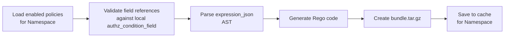

# OPA Integration (Federated Library)

This document covers the OPA input contract, the local policy compiler pipeline, Rego code generation, local bundle management, and OPA deployment topology in the federated model.

---

## 1. OPA Input Contract

The calling service (**PEP — Policy Enforcement Point**) must construct the following input when querying its local OPA sidecar.

### Fixed Fields (always present)

| Field | Type | Source | Description |
|---|---|---|---|
| `input.user.id` | Number | JWT / Session | The authenticated user's ID |
| `input.user.roles` | String[] | JWT / Session | User's assigned role names (issued by IdP) |
| `input.permission` | String | Application code | The permission code (e.g., `finance:journal:create`) |

### Dynamic Fields (vary by resource)

| Field | Type | Source | Description |
|---|---|---|---|
| `input.resource.*` | Varies | Application context | Resource-specific attributes relevant to the current operation |

### Example — Creating a journal entry

```json
{
  "input": {
    "user": { "id": 42, "roles": ["ACCOUNTANT", "MANAGER"] },
    "permission": "finance:journal:create",
    "resource": {
      "amount": 8500,
      "bank": "HDFC",
      "type": "EXPENSE"
    }
  }
}
```

### PEP Responsibility and AOP Enforcement

The PEP (middleware or shared library) is responsible for:
1. Extracting the user and roles from the incoming JWT (issued by the central Identity module).
2. Constructing the `input` JSON with the resource context.
3. Sending the query to the local OPA sidecar for the specific namespace (e.g., `POST /v1/data/app/authz/{namespace}/allow`) and enforcing the decision.

**Recommended Implementation:**
Use an AOP Aspect in the Application Layer to intercept use cases. The aspect inspects the incoming Command object, reads the `@PolicyResource` annotation to extract the `namespace`, `name`, and `action` (which form `permission`, e.g., `finance:journal:create`), and reads the `@PolicyField` values to build the `input.resource` JSON.

---

## 2. Local Policy Compiler Pipeline

The `authz-core` library acts as a **Policy Compiler** that translates the local DB policies into Rego code.

### Workflow



1. **Load:** Fetch all enabled, non-deleted policies from the local `authz_policy` table for the *affected namespace*.
2. **Validate:** Check that all field references in `expression_json` exist in the local `authz_condition_field` registry. Skip policies with deprecated fields.
3. **Parse & Compile:** Parse the AST and translate it into Rego code scoped to the namespace (e.g., `package app.authz.finance`).
4. **Bundle:** Compress into `bundle.tar.gz`.
5. **Cache:** Generate an `ETag` (MD5 hash) and upsert into the local `authz_policy_bundle_cache` table for that specific namespace.

### AST to Rego Translation Algorithm

When translating the `expression_json` AST into Rego:

- **AND Groups:** Multiple conditions inside an `AND` block are simply appended as new lines within the same Rego rule block, because statements in a Rego block are implicitly `AND`ed.
  ```rego
  allow_rule if {
      input.resource.amount <= 10000
      input.resource.bank != "CASH"
  }
  ```
- **OR Groups:** An `OR` block requires the compiler to generate **multiple Rego blocks** for the same policy. In Rego, multiple blocks with the same name act as a logical `OR`.
  ```rego
  # Condition: amount <= 1000 OR bank == "HDFC"
  allow_rule if {
      input.resource.amount <= 1000
  }
  allow_rule if {
      input.resource.bank == "HDFC"
  }
  ```

---

## 3. Generated Rego — Corrected DENY Logic

The compiler generates Rego with separate `allow_rule` and `deny_rule` blocks, combined via a final `allow` decision that enforces DENY-overrides-ALLOW:

```rego
package app.authz.finance

default allow := false
default deny_rule := false

# --- ALLOW Rules ---

# Accountant Policy
allow_rule if {
    "ACCOUNTANT" in input.user.roles
    input.permission == "finance:journal:create"
    input.resource.amount <= 10000
}

# --- DENY Rules ---

# John Deny Policy (unconditional)
deny_rule if {
    input.user.id == 123
    input.permission == "finance:journal:create"
}

# --- Final Decision ---
allow if {
    allow_rule
    not deny_rule
}
```

---

## 4. Local Bundle Serving & Regeneration

### Bundle Serving Endpoint

The `authz-core` library exposes an endpoint on the microservice itself:
```
GET /internal/authz/bundle/{namespace}

Headers:
  If-None-Match: "abc123"       (OPA's current ETag)
```

### Bundle Regeneration Strategy

Bundle regeneration is triggered **on-demand** when an admin saves policy changes via the local library's REST API. The library recompiles only the namespace that was modified.

```text
Admin saves policy changes via UI
    → API Gateway routes request to specific microservice (e.g., Finance)
    → Library updates policy rows in local DB
    → Library recompiles bundle for the affected namespace and upserts into local authz_policy_bundle_cache
    → Returns 200 OK
    → Next local OPA poll for that namespace picks up the new bundle
```

---

## 5. OPA Deployment Topology

**One OPA instance per application instance.**

### OPA Configuration

In a microservice or modulith, the local OPA sidecar loads the bundle directly from its host application (which runs the `authz-core` library). OPA configuration is generated at startup to poll multiple topic-wise endpoints for all active namespaces.

```yaml
services:
  local-app:
    url: http://localhost:8080

bundles:
  finance:
    service: local-app
    resource: /internal/authz/bundle/finance
    polling:
      min_delay_seconds: 10
      max_delay_seconds: 30
  clinical:
    service: local-app
    resource: /internal/authz/bundle/clinical
    polling:
      min_delay_seconds: 10
      max_delay_seconds: 30

decision_logs:
  console: true
```

Because OPA runs side-by-side with the application and fetches the bundles locally, there is virtually zero network latency for authorization checks.
