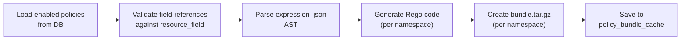

# OPA Integration

This document covers the OPA input contract, the policy compiler pipeline, Rego code generation, per-namespace bundle management, and OPA deployment topology.

---

## 1. OPA Input Contract

The calling service (**PEP — Policy Enforcement Point**) must construct the following input when querying OPA.

### Fixed Fields (always present)

| Field | Type | Source | Description |
|---|---|---|---|
| `input.user.id` | Number | JWT / Session | The authenticated user's ID |
| `input.user.roles` | String[] | `user_role` table | User's assigned role names |
| `input.permission` | String | Application code | The permission code (e.g., `finance:journal:create`) |

### Dynamic Fields (vary by resource)

| Field | Type | Source | Description |
|---|---|---|---|
| `input.resource.*` | Varies | Application context | Resource-specific attributes relevant to the current operation |

The shape of `input.resource` is **dynamic** — it depends on what resource is being accessed. The calling service passes the fields defined in the `resource_field` registry for that resource.

### Example — Creating a journal entry

```json
{
  "input": {
    "user": { "id": 42, "roles": ["ACCOUNTANT", "MANAGER"] },
    "permission": "finance:journal:create",
    "resource": {
      "amount": 8500,
      "bank": "HDFC",
      "type": "EXPENSE"
    }
  }
}
```

### Example — Viewing a patient record

```json
{
  "input": {
    "user": { "id": 42, "roles": ["NURSE"] },
    "permission": "clinical:patient:view",
    "resource": {
      "ward": "ICU",
      "severity": "CRITICAL"
    }
  }
}
```

### PEP Responsibility and AOP Enforcement

The PEP (middleware or shared library) is responsible for:

1. Extracting the user from the JWT / session
2. Looking up their roles from the `user_role` table
3. Constructing the `input` JSON with the resource context from the current operation
4. Sending the query to OPA and enforcing the decision

**Recommended Implementation:**
Use an AOP Aspect in the Application Layer to intercept use cases. The aspect inspects the incoming Command object, reads the `@PolicyResource` annotation to extract the `namespace`, `name`, and `action` (which combine to form the `permission` code, e.g., `finance:journal:create`), and reads the `@PolicyField` values to build the `input.resource` JSON. This keeps the Use Case logic 100% free of authorization code.

---

## 2. Policy Compiler Pipeline

Instead of evaluating permissions in the database at runtime, a Java service acts as a **Policy Compiler** that translates DB policies into Rego code.

### Workflow



1. **Load:** Fetch all enabled, non-deleted policies from the database for the affected namespace.
2. **Validate:** Check that all field references in `expression_json` exist in the `resource_field` registry and have correct types. Skip policies with deprecated fields (they should already be auto-disabled).
3. **Parse & Compile:** Parse the `expression_json` AST and recursively translate it into Rego code.
4. **Generate DENY guard:** For each namespace, generate `allow_rule` and `deny_rule` blocks. The final `allow` rule uses the `not deny_rule` pattern to ensure DENY always overrides ALLOW.
5. **Bundle:** Compress into `bundle.tar.gz` with the appropriate Rego file(s) and `manifest.json`.
6. **Cache:** Generate an `ETag` (MD5 hash of the bundle) and upsert both the BLOB and ETag into `policy_bundle_cache` for this namespace.

---

## 3. Generated Rego — Corrected DENY Logic

The compiler generates Rego with separate `allow_rule` and `deny_rule` blocks, combined via a final `allow` decision that enforces DENY-overrides-ALLOW:

```rego
package finance.authz

default allow := false
default deny_rule := false

# --- ALLOW Rules ---

# Accountant Policy
allow_rule if {
    "ACCOUNTANT" in input.user.roles
    input.permission == "finance:journal:create"
    input.resource.amount <= 10000
}

# Manager Policy
allow_rule if {
    "MANAGER" in input.user.roles
    input.permission == "finance:journal:create"
    input.resource.amount <= 20000
}

# User 42 Override
allow_rule if {
    input.user.id == 42
    input.permission == "finance:journal:create"
    input.resource.amount <= 15000
}

# Unconditional view access for Accountant
allow_rule if {
    "ACCOUNTANT" in input.user.roles
    input.permission == "finance:journal:view"
}

# --- DENY Rules ---

# John Deny Policy (unconditional)
deny_rule if {
    input.user.id == 123
    input.permission == "finance:journal:create"
}

# --- Final Decision ---
# DENY always overrides ALLOW
allow if {
    allow_rule
    not deny_rule
}
```

### How This Evaluates

- Multiple `allow_rule if {...}` blocks are **OR'd** → most permissive match wins
- Multiple `deny_rule if {...}` blocks are **OR'd** → any matching deny blocks access
- `allow` is only `true` if **at least one** `allow_rule` matches AND **zero** `deny_rule` match

### Evaluation Examples

| User | Permission | Resource | allow_rule | deny_rule | **Result** |
|---|---|---|---|---|---|
| User 42 (ACCOUNTANT, MANAGER) | finance:journal:create | amount: 8500 | ✅ (ACCOUNTANT ≤10K) | ❌ | **ALLOW** |
| User 42 (ACCOUNTANT, MANAGER) | finance:journal:create | amount: 15000 | ✅ (MANAGER ≤20K, USER ≤15K) | ❌ | **ALLOW** |
| User 42 (ACCOUNTANT, MANAGER) | finance:journal:create | amount: 25000 | ❌ (all exceed) | ❌ | **DENY** |
| User 123 (ACCOUNTANT) | finance:journal:create | amount: 5000 | ✅ (ACCOUNTANT ≤10K) | ✅ (user 123 deny) | **DENY** |

---

## 4. Per-Namespace Bundle Management

Each namespace gets its own `bundle.tar.gz`, stored independently in `policy_bundle_cache`.

### Bundle Structure

```
finance-bundle.tar.gz
├── finance/
│   └── authz.rego        # package finance.authz
└── .manifest             # OPA bundle manifest
```

### Bundle Serving Endpoint

```
GET /bundles/{namespace}

Headers:
  If-None-Match: "abc123"       (OPA's current ETag)

Response (bundle changed):
  200 OK
  Content-Type: application/gzip
  ETag: "def456"
  Body: <bundle.tar.gz bytes>

Response (bundle unchanged):
  304 Not Modified
```

### Bundle Regeneration Strategy

Bundle regeneration is triggered **on-demand** when an admin saves policy changes via the UI.

```
Admin saves policy changes for a role
    → Backend updates policy rows in DB
    → Backend identifies affected namespace(s)
    → For each affected namespace:
        → PolicyCompiler.regenerateBundle(namespaceId)
        → New bundle + ETag upserted into policy_bundle_cache
    → Returns 200 OK to the admin UI
    → Next OPA poll picks up the new bundle
```

**Why not event-driven:** The only source of policy changes is the admin UI. Synchronous regeneration on save is the simplest correct approach.

**Optimization (if needed later):** If regeneration becomes slow with thousands of policies, make it async — return 200 OK immediately, fire an async task, and show a "Publishing changes..." toast in the UI.

---

## 5. OPA Deployment

**One OPA instance per application instance**, for both modulith and microservice deployments.

### OPA Configuration (Modulith)

In a modulith, the single OPA instance loads bundles for **all namespaces**:

```yaml
services:
  identity-backend:
    url: http://localhost:8080

bundles:
  finance:
    service: identity-backend
    resource: /bundles/finance
    polling:
      min_delay_seconds: 10
      max_delay_seconds: 30
  clinical:
    service: identity-backend
    resource: /bundles/clinical
    polling:
      min_delay_seconds: 10
      max_delay_seconds: 30
  inventory:
    service: identity-backend
    resource: /bundles/inventory
    polling:
      min_delay_seconds: 10
      max_delay_seconds: 30

decision_logs:
  console: true
```

### OPA Configuration (Microservices — Future)

Each microservice's OPA loads **only its namespace**:

```yaml
# Finance service's OPA config
services:
  identity-backend:
    url: http://identity-service:8080

bundles:
  finance:
    service: identity-backend
    resource: /bundles/finance
    polling:
      min_delay_seconds: 10
      max_delay_seconds: 30
```

### Adding New Namespaces

When a new namespace is auto-registered at startup, the OPA config must be updated to include the new bundle source. This requires an OPA restart.

For fully dynamic namespace discovery (no restart), OPA's [Discovery](https://www.openpolicyagent.org/docs/latest/management-discovery/) feature can be used later — a "discovery bundle" tells OPA what other bundles to load. Not necessary for the initial implementation.
