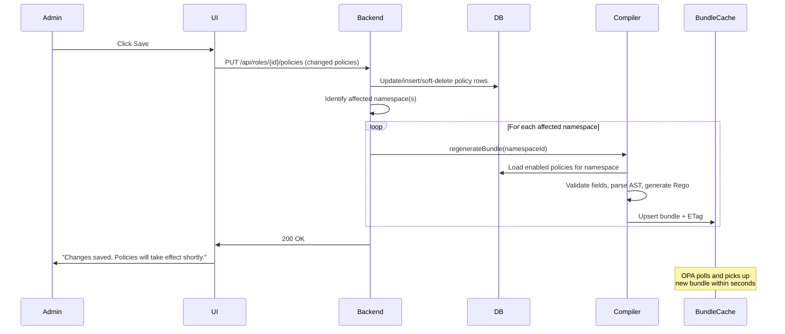

# Admin UI Workflow

This document describes the admin-facing UI flows for managing role-permission mappings, building conditions, and handling deprecated field warnings.

---

## 1. Role-Permission Grid

The primary UI for managing authorization. The admin selects a role and sees a grid of all available permissions, grouped by resource.

### Layout

```
┌─────────────────────────────────────────────────────────────────┐
│  Role: [ACCOUNTANT ▼]                                  [Save]   │
├─────────────────────────────────────────────────────────────────┤
│                                                                  │
│  📁 finance / journal                                            │
│  ┌─────────────────────────────────────────────────────────────┐ │
│  │ ☑ create    [Conditions: amount ≤ 10K]              [⚙] [🔛]│ │
│  │ ☑ view      [No conditions]                         [⚙] [🔛]│ │
│  │ ☐ delete    [—]                                          │ │
│  │ ☐ approve   [—]                                          │ │
│  └─────────────────────────────────────────────────────────────┘ │
│                                                                  │
│  📁 finance / report                                             │
│  ┌─────────────────────────────────────────────────────────────┐ │
│  │ ☑ view      [No conditions]                         [⚙] [🔛]│ │
│  │ ☐ export    [—]                                          │ │
│  └─────────────────────────────────────────────────────────────┘ │
│                                                                  │
└─────────────────────────────────────────────────────────────────┘
```

### Actions

| Action | What It Does | DB Effect |
|---|---|---|
| **Check** a permission | Grants the permission to this role (unconditional) | Creates a `policy` row: `effect=ALLOW, expression_json=NULL` |
| **Uncheck** a permission | Revokes the permission | Soft-deletes the `policy` row |
| **⚙ (Conditions)** | Opens the condition builder | Updates `policy.expression_json` |
| **🔛 (Enable/Disable toggle)** | Temporarily disables a policy without removing it | Toggles `policy.enabled` |
| **Save** | Persists all changes and triggers bundle regeneration | Updates policy rows → triggers `PolicyCompiler.regenerateBundle()` for affected namespace(s) |

### Data Query

The grid is populated by querying the `policy` table filtered by role:

```sql
SELECT 
    p.code AS permission_code,
    p.action,
    r.name AS resource_name,
    ns.name AS namespace_name,
    pol.id AS policy_id,
    pol.effect,
    pol.expression_json,
    pol.enabled,
    pol.disabled_reason
FROM permission p
JOIN resource r ON p.resource_id = r.id
JOIN permission_namespace ns ON r.namespace_id = ns.id
LEFT JOIN policy pol ON pol.permission_id = p.id 
    AND pol.subject_type = 'ROLE' 
    AND pol.subject_id = :roleId
    AND pol.deleted_at IS NULL
WHERE p.deleted_at IS NULL
  AND r.deleted_at IS NULL
ORDER BY ns.name, r.name, p.action;
```

- `LEFT JOIN` ensures unchecked permissions (no policy row) still appear in the grid
- A non-null `pol.id` means the permission is checked (mapped)
- `pol.expression_json IS NOT NULL` means conditions are attached

---

## 2. Condition Builder

A visual rule builder that opens when the admin clicks **⚙** on a permission. Powered by the `condition_field` registry.

### Layout

```
┌──────────────────────────────────────────────────────────────┐
│  Condition Builder — finance:journal:create                   │
├──────────────────────────────────────────────────────────────┤
│                                                               │
│  IF  [ALL ▼]  of the following:                               │
│                                                               │
│  ┌──────────────────────────────────────────────────────────┐ │
│  │  [amount      ▼]   [<=  ▼]   [10000          ]   [✕]   │ │
│  │  [bank        ▼]   [!=  ▼]   [CASH          ▼]   [✕]   │ │
│  │                                          [+ Add Rule]    │ │
│  └──────────────────────────────────────────────────────────┘ │
│                                                               │
│  [+ Add Group]     (creates nested AND/OR group)              │
│                                                               │
│                                  [Cancel]     [Apply]         │
└──────────────────────────────────────────────────────────────┘
```

### How Fields Are Loaded

The condition builder fetches available fields from the `condition_field` table:

```sql
SELECT field_name, field_type, display_name, allowed_values, options_endpoint
FROM condition_field
WHERE permission_id = :permissionId
  AND status = 'ACTIVE'        -- excludes deprecated fields
  AND deleted_at IS NULL
ORDER BY display_name;
```

### Field-Type-Aware Controls

| Element | Behavior |
|---|---|
| **Field dropdown** | Populated from `condition_field` for this specific action/permission. Only `ACTIVE` fields shown. |
| **Operator dropdown** | Filtered by `field_type`: NUMBER gets `<=, >=, ==, !=, <, >`; STRING gets `==, !=, in, not_in` |
| **Value input** | • Free text for `NUMBER`/`DATE`<br>• Static dropdown if `allowed_values` exists (e.g., bank → CASH, HDFC)<br>• Dynamic dropdown if `options_endpoint` exists. UI fetches data on the fly and expects `[{id, display}]`. |
| **ALL/ANY toggle** | Maps to `"operator": "AND"` / `"operator": "OR"` in the JSON AST |
| **Add Group** | Creates a nested condition group (for complex `(A AND B) OR (C AND D)` logic) |

### Validation on Apply

When the admin clicks **Apply**, the condition is validated:
1. All fields must exist in `condition_field` and be `ACTIVE`
2. All values must match the field's `field_type`
3. If `allowed_values` is defined, the value must be in the list

---

## 3. Deprecated Field Warnings

When a field is removed from code and policies are auto-disabled (see [03-policy-engine.md §3.2](file:///Users/apple/Documents/opa_integration_backend/03-policy-engine.md)), the admin UI shows a warning.

### Warning Banner

Displayed at the top of the role-permission grid when any policies have been auto-disabled:

```
┌──────────────────────────────────────────────────────────────┐
│  ⚠️ 2 policies were auto-disabled because referenced fields  │
│     were removed from code.                                   │
│                                                               │
│  • ACCOUNTANT → finance:journal:create                        │
│    Field "bank" was removed from code                         │
│  • MANAGER → finance:journal:create                           │
│    Field "bank" was removed from code                         │
│                                                               │
│  [Review & Fix]                                               │
└──────────────────────────────────────────────────────────────┘
```

### Data Query for Warnings

```sql
SELECT 
    pol.id,
    pol.disabled_reason,
    pol.subject_type,
    CASE pol.subject_type 
        WHEN 'ROLE' THEN r.name 
        WHEN 'USER' THEN u.name 
    END AS subject_name,
    p.code AS permission_code
FROM policy pol
JOIN permission p ON pol.permission_id = p.id
LEFT JOIN role r ON pol.subject_type = 'ROLE' AND pol.subject_id = r.id
LEFT JOIN "user" u ON pol.subject_type = 'USER' AND pol.subject_id = u.id
WHERE pol.enabled = false
  AND pol.disabled_reason IS NOT NULL
  AND pol.deleted_at IS NULL
ORDER BY pol.updated_at DESC;
```

### Admin Actions on Disabled Policies

| Action | Effect |
|---|---|
| **Edit conditions** | Opens the condition builder. Admin removes or replaces the deprecated field reference. On save, `enabled` is set back to `true` and `disabled_reason` is cleared. |
| **Delete policy** | Soft-deletes the policy. If no other policies reference the deprecated field, it is auto-removed on next startup. |
| **Re-enable (force)** | Admin can force-enable a policy with a deprecated field — but the condition will silently fail at OPA runtime (field won't be in `input.resource`). UI should show a warning. |

---

## 4. Save Workflow

When the admin clicks **Save** on the role-permission grid:


