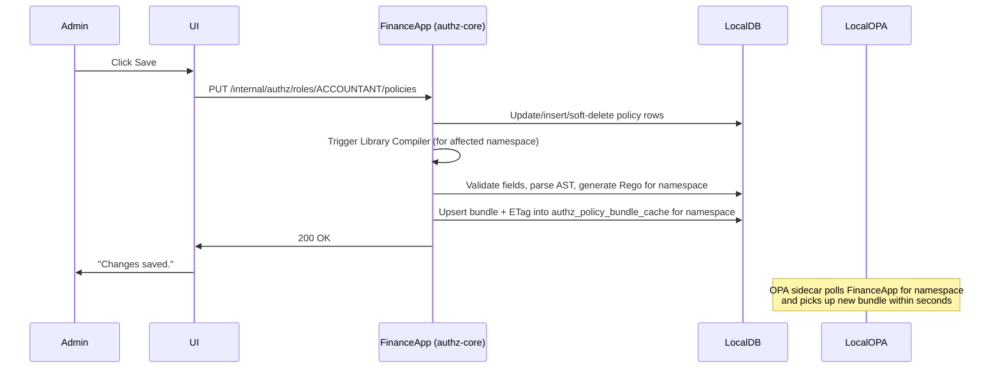

# Admin UI Workflow (Federated Model)

This document describes the admin-facing UI flows in the federated library architecture, where the UI must aggregate data from the central Identity Provider and the individual application modules.

---

## 1. Role-Permission Grid

The primary UI for managing authorization. Because permissions and policies live inside the individual application microservices, the UI is organized by **Module Tabs**.

### Layout

```text
┌─────────────────────────────────────────────────────────────────┐
│  Role: [ACCOUNTANT ▼]    (fetched from IdP)                     │
├─────────────────────────────────────────────────────────────────┤
│                                                                 │
│  [ Finance Module ]  [ Clinical Module ]  [ Inventory Module ]  │
│                                                                 │
│  📁 journal                                                     │
│  ┌─────────────────────────────────────────────────────────────┐│
│  │ ☑ create    [Conditions: amount ≤ 10K]              [⚙] [🔛]││
│  │ ☑ view      [No conditions]                         [⚙] [🔛]││
│  │ ☐ delete    [—]                                             ││
│  │ ☐ approve   [—]                                             ││
│  └─────────────────────────────────────────────────────────────┘│
│                                                                 │
│  📁 report                                                      │
│  ┌─────────────────────────────────────────────────────────────┐│
│  │ ☑ view      [No conditions]                         [⚙] [🔛]││
│  │ ☐ export    [—]                                             ││
│  └─────────────────────────────────────────────────────────────┘│
│                                                                 │
│                                                      [Save]     │
└─────────────────────────────────────────────────────────────────┘
```

### Data Query (How the UI gets data)

1. **Fetch Roles:** The UI fetches the available roles from the central Identity Provider (`GET /api/idp/roles`).
2. **Fetch Policies:** When the user clicks the "Finance Module" tab, the UI calls the Finance microservice directly (or via an API Gateway routing to Finance).

The `authz-core` library in the Finance module executes this local query:

```sql
SELECT 
    p.code AS permission_code,
    p.action,
    r.namespace,
    r.name AS resource_name,
    pol.id AS policy_id,
    pol.effect,
    pol.expression_json,
    pol.enabled,
    pol.disabled_reason
FROM authz_permission p
JOIN authz_resource r ON p.resource_id = r.id
LEFT JOIN authz_policy pol ON pol.permission_id = p.id 
    AND pol.subject_type = 'ROLE' 
    AND pol.subject_id = :roleName
    AND pol.deleted_at IS NULL
WHERE p.deleted_at IS NULL
  AND r.deleted_at IS NULL
ORDER BY r.namespace, r.name, p.action;
```

---

## 2. Condition Builder

A visual rule builder that opens when the admin clicks **⚙** on a permission. Powered by the local `authz_condition_field` registry.

### Layout

```text
┌──────────────────────────────────────────────────────────────┐
│  Condition Builder — journal:create                           │
├──────────────────────────────────────────────────────────────┤
│                                                               │
│  IF  [ALL ▼]  of the following:                               │
│                                                               │
│  ┌──────────────────────────────────────────────────────────┐ │
│  │  [amount      ▼]   [<=  ▼]   [10000          ]   [✕]   │ │
│  │  [bank        ▼]   [!=  ▼]   [CASH          ▼]   [✕]   │ │
│  │                                          [+ Add Rule]    │ │
│  └──────────────────────────────────────────────────────────┘ │
│                                                               │
│  [+ Add Group]     (creates nested AND/OR group)              │
│                                                               │
│                                  [Cancel]     [Apply]         │
└──────────────────────────────────────────────────────────────┘
```

### How Fields Are Loaded

The condition builder fetches fields from the library's local table:

```sql
SELECT field_name, field_type, display_name, allowed_values, options_endpoint
FROM authz_condition_field
WHERE permission_id = :permissionId
  AND status = 'ACTIVE'        
  AND deleted_at IS NULL
ORDER BY display_name;
```

### Field-Type-Aware Controls

| Element | Behavior |
|---|---|
| **Field dropdown** | Populated from `authz_condition_field` for this specific action/permission. Only `ACTIVE` fields shown. |
| **Operator dropdown** | Filtered by `field_type`: NUMBER gets `<=, >=, ==, !=, <, >`; STRING gets `==, !=, in, not_in` |
| **Value input** | • Free text for `NUMBER`/`DATE`<br>• Static dropdown if `allowed_values` exists<br>• Dynamic dropdown if `options_endpoint` exists. UI fetches data on the fly and expects `[{id, display}]`. |
| **ALL/ANY toggle** | Maps to `"operator": "AND"` / `"operator": "OR"` in the JSON AST |

---

## 3. Deprecated Field Warnings

When a field is removed from local code and policies are auto-disabled, the admin UI shows a warning banner *inside* that module's tab.

### Warning Banner

```text
┌──────────────────────────────────────────────────────────────┐
│  ⚠️ 2 policies were auto-disabled because referenced fields  │
│     were removed from code.                                   │
│                                                               │
│  • ACCOUNTANT → journal:create                                │
│    Field "bank" was removed from code                         │
│                                                               │
│  [Review & Fix]                                               │
└──────────────────────────────────────────────────────────────┘
```

### Admin Actions on Disabled Policies

| Action | Effect |
|---|---|
| **Edit conditions** | Opens the condition builder. Admin removes or replaces the deprecated field reference. On save, `enabled` is set back to `true` and `disabled_reason` is cleared. |
| **Delete policy** | Soft-deletes the policy. If no other policies reference the deprecated field, the local diff-sync auto-removes it on next startup. |

---

## 4. Save Workflow

When the admin clicks **Save** inside a module tab:


