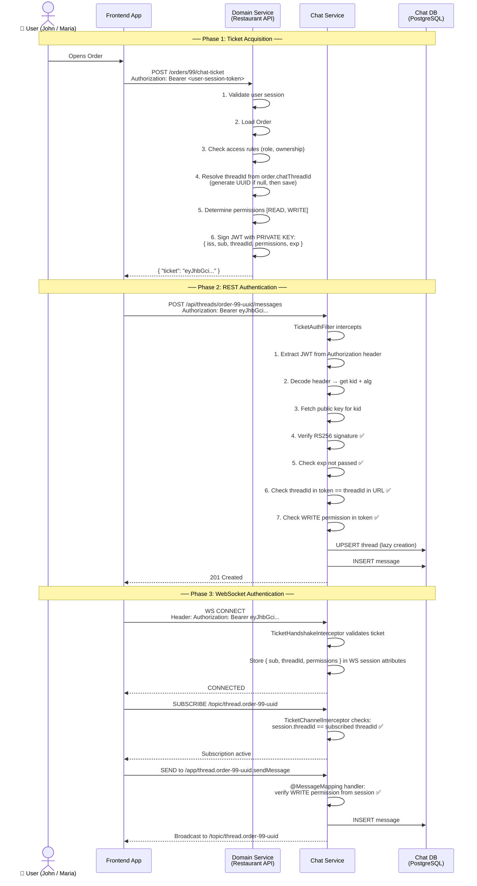
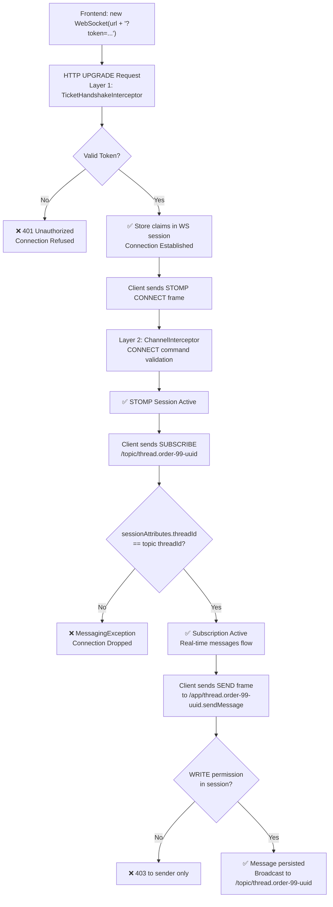
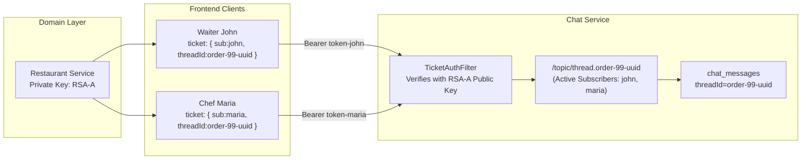

# 🔐 Chat Engine — Authentication Deep Dive

> **Scope**: End-to-end technical specification of the Delegated Ticket Authentication system used by the Standalone Chat Engine. Covers identity, authorization delegation, JWT lifecycle, REST & WebSocket security, and threat modeling.

---

## 1. Authentication Philosophy

### Why the Chat Service Has No Auth Logic

Traditional microservices own their own authorization rules. This Chat Service deliberately **does not**. Here's why:

```
❌ Traditional Approach (Coupled)
────────────────────────────────────────────────────────
Chat Service must know:
  - Is this user a Waiter, Chef, Manager?
  - Does Order #99 belong to this user's restaurant?
  - Is this consultation assigned to this doctor?
  - Is this purchase order visible to the finance team?

→ Chat Service becomes tightly coupled to every domain.
→ Any business rule change requires a Chat Service update.
→ Chat Service cannot be reused across domains.

✅ Delegated Ticket Approach (Decoupled)
────────────────────────────────────────────────────────
Chat Service only knows:
  - Is this JWT cryptographically valid? (signature check)
  - Is the threadId in the token the same as the one being accessed?
  - Has the token expired?

→ Chat Service is domain-agnostic and infinitely reusable.
→ Business rules live where they belong: in the Domain Service.
→ Plugging in a new domain = 1 endpoint + 1 key registration.
```

**Principle**: The Chat Service is an authenticator, not an authorizer. It trusts the ticket, not the caller.

---

## 2. The JWT Ticket — Anatomy

A JWT (JSON Web Token) is a compact, self-contained token with three Base64URL-encoded parts joined by dots.

```
eyJhbGciOiJSUzI1NiIsInR5cCI6IkpXVCJ9
.
eyJzdWIiOiJqb2huIiwidGhyZWFkSWQiOiJvcmRlci05OS11dWlkIiwicm9sZSI6InN0YWZmIiwiaXNzIjoicmVzdGF1cmFudC1zZXJ2aWNlIiwiaWF0IjoxNzI3MTUyMDAwLCJleHAiOjE3MjcxNTIzMDB9
.
[RS256 Signature Bytes]

 ◄─── HEADER ───►  ◄──────────────── PAYLOAD ──────────────────►  ◄─ SIGNATURE ─►
```

### 2.1 Header

```json
{
  "alg": "RS256",
  "typ": "JWT",
  "kid": "restaurant-key-v1"
}
```

| Field | Purpose |
|---|---|
| `alg` | Signing algorithm. `RS256` = RSA + SHA-256 (asymmetric) |
| `typ` | Token type, always `JWT` |
| `kid` | **Key ID** — tells the Chat Service which public key to use for verification. Critical for multi-domain setups and key rotation |

### 2.2 Payload (Claims)

```json
{
  "iss": "restaurant-service",
  "sub": "john",
  "threadId": "order-99-uuid",
  "permissions": ["READ", "WRITE"],
  "iat": 1727152000,
  "exp": 1727152300,
  "jti": "unique-token-id-abc123"
}
```

| Claim | Type | Description |
|---|---|---|
| `iss` | String | **Issuer** — which Domain Service signed this (e.g., `restaurant-service`) |
| `sub` | String | **Subject** — the user identity (e.g., `john`, `maria`) |
| `threadId` | String (UUID) | **Custom claim** — the specific chat thread this ticket grants access to |
| `permissions` | Array | **Custom claim** — `READ` and/or `WRITE`. Enables read-only tickets |
| `iat` | Unix Timestamp | **Issued At** — when the ticket was created |
| `exp` | Unix Timestamp | **Expiry** — when the ticket stops being valid |
| `jti` | String | **JWT ID** — unique ID per ticket, used to prevent replay attacks |

### 2.3 Signature

```
RS256_SIGNATURE = RSA_SIGN(
  SHA256( Base64URL(Header) + "." + Base64URL(Payload) ),
  DOMAIN_PRIVATE_KEY
)
```

- Computed by the **Domain Service** using its **private key**
- Verified by the **Chat Service** using the corresponding **public key**
- Any modification to Header or Payload **invalidates** the signature

---

## 3. Signing Strategy — RS256 Asymmetric

> [!IMPORTANT]
> RS256 (asymmetric) is **mandatory** for a multi-domain setup. HS256 (shared secret) requires every domain to share one secret with the Chat Service — a serious security risk.

### Key Pair Model

```
┌──────────────────────────────────────────────────────────────┐
│  Domain Service (e.g., Restaurant Service)                  │
│                                                              │
│  PRIVATE KEY (kept secret, never shared)                     │
│  ├── Used to SIGN the JWT ticket                             │
│  └── Never leaves the Domain Service                         │
└────────────────────┬─────────────────────────────────────────┘
                     │ Public Key shared once (at registration)
                     ▼
┌──────────────────────────────────────────────────────────────┐
│  Chat Service                                                │
│                                                              │
│  PUBLIC KEY (for restaurant-service)                         │
│  ├── Used to VERIFY the JWT signature                        │
│  └── Cannot be used to create new tickets                    │
└──────────────────────────────────────────────────────────────┘
```

### Why Asymmetric?

```
If Chat Service is compromised:
  HS256 → Attacker steals shared secret → Can forge tickets for ANY domain ❌
  RS256 → Attacker gets public key only → Cannot sign anything ✅

If a Domain Service is compromised:
  Only that domain's private key is at risk.
  Other domains' chats remain unaffected. ✅
```

### Key Generation (One-time per Domain)

```bash
# Generate RSA-2048 private key
openssl genrsa -out restaurant-private.pem 2048

# Extract public key
openssl rsa -in restaurant-private.pem -pubout -out restaurant-public.pem

# Private key → stays in Restaurant Service (env var / secrets vault)
# Public key  → registered with Chat Service (JWKS or config)
```

---

## 4. Multi-Domain Key Management

The Chat Service must know the public key of every Domain Service that issues tickets.

### Option A — Static Configuration (Simple, Recommended to Start)

```yaml
# chat-service/application.yml
chat:
  ticket:
    issuers:
      - issuer: "restaurant-service"
        kid: "restaurant-key-v1"
        public-key: |
          -----BEGIN PUBLIC KEY-----
          MIIBIjANBgkqhkiG9w0BAQEFAAOCAQ8AMIIBCgKCAQEA...
          -----END PUBLIC KEY-----

      - issuer: "emr-service"
        kid: "emr-key-v1"
        public-key: |
          -----BEGIN PUBLIC KEY-----
          MIIBIjANBgkqhkiG9w0BAQ...
          -----END PUBLIC KEY-----

      - issuer: "finance-service"
        kid: "finance-key-v1"
        public-key: |
          -----BEGIN PUBLIC KEY-----
          MIIBIjANBgkqhkiG9w0BAQ...
          -----END PUBLIC KEY-----
```

### Option B — JWKS Endpoint (Industry Standard, Recommended for Production)

Each Domain Service exposes a standard JSON Web Key Set endpoint:

```
GET https://restaurant.api.com/.well-known/jwks.json

Response:
{
  "keys": [
    {
      "kty": "RSA",
      "kid": "restaurant-key-v1",
      "use": "sig",
      "alg": "RS256",
      "n": "syfp2...",
      "e": "AQAB"
    }
  ]
}
```

The Chat Service fetches and caches these keys at startup (and refreshes when it encounters an unknown `kid`):

```
Chat Service Key Resolution:
─────────────────────────────────────────────────────
1. Receive JWT with header: { kid: "restaurant-key-v1", alg: "RS256" }
2. Look up key in local cache by kid
3. FOUND → use cached public key to verify
4. NOT FOUND → fetch from JWKS endpoint of issuer → cache → verify
5. STILL NOT FOUND → reject with 401
```

### Key Rotation (Zero-Downtime)

```
Step 1: Restaurant Service generates new key pair (kid: "restaurant-key-v2")
Step 2: Restaurant Service adds NEW key to its JWKS endpoint (keeping old one too)
Step 3: Restaurant Service starts signing new tickets with v2 key
Step 4: Old tickets with v1 expire naturally (5-minute TTL)
Step 5: Restaurant Service removes v1 from JWKS
Step 6: Chat Service cache evicts v1 naturally

→ Zero downtime. Zero coordination with Chat Service team.
```

---

## 5. Ticket Lifecycle — Complete Flow



---

## 6. REST API Authentication — `TicketAuthFilter`

Every REST request to the Chat Service passes through a Spring Security filter chain.

### Filter Chain Position

```
Incoming HTTP Request
        ↓
[ JwtTicketAuthFilter ]  ← custom filter
        ↓
  Extract JWT from "Authorization: Bearer <token>" header
        ↓
  Decode & validate token (see Section 8)
        ↓
  Inject SecurityContext: Authentication { sub, threadId, permissions }
        ↓
[ Spring Security Authorization ]
        ↓
  @PreAuthorize checks or method-level guards
        ↓
  Controller Method
```

### Request-Level threadId Binding

```
URL:   POST /api/threads/{threadId}/messages
Token: { threadId: "order-99-uuid", ... }

Filter checks:
  URL path variable threadId == token.threadId
  ✅ Match → proceed
  ❌ Mismatch → 403 Forbidden

This prevents: John using his valid token to POST to a different thread.
```

### Pseudocode — Filter Logic

```java
public class JwtTicketAuthFilter extends OncePerRequestFilter {

    @Override
    protected void doFilterInternal(HttpServletRequest request, ...) {

        // 1. Extract token
        String token = extractBearerToken(request);
        if (token == null) { sendUnauthorized(response); return; }

        // 2. Decode header (no verification yet — just to read kid/iss)
        JwtHeader header = decodeHeader(token);

        // 3. Fetch correct public key by kid
        PublicKey publicKey = keyRegistry.getKey(header.getKid());
        if (publicKey == null) { sendUnauthorized(response); return; }

        // 4. Full verification (signature + expiry + claims)
        Claims claims = JwtVerifier.verify(token, publicKey);
        // throws JwtException if invalid

        // 5. Thread ID binding
        String urlThreadId = extractThreadIdFromPath(request);
        if (urlThreadId != null && !urlThreadId.equals(claims.get("threadId"))) {
            sendForbidden(response); return;
        }

        // 6. Inject into Spring Security context
        TicketAuthentication auth = new TicketAuthentication(claims);
        SecurityContextHolder.getContext().setAuthentication(auth);

        filterChain.doFilter(request, response);
    }
}
```

---

## 7. WebSocket (STOMP) Authentication — Three Layers

WebSocket authentication is more nuanced than REST. There are **three distinct interception points**.

### Layer Architecture

```
WebSocket Connection Lifecycle
──────────────────────────────────────────────────────────────────
Layer 1: HTTP Handshake (UPGRADE request)
         → TicketHandshakeInterceptor
         → Validates token BEFORE WebSocket is established
         → Stores { sub, threadId, permissions } in WS session

Layer 2: STOMP CONNECT frame
         → TicketChannelInterceptor (CONNECT command)
         → Secondary validation (defense-in-depth)
         → Associates STOMP session with verified identity

Layer 3: STOMP SUBSCRIBE frame
         → TicketChannelInterceptor (SUBSCRIBE command)
         → Ensures /topic/thread.{X} matches token's threadId
         → Prevents subscribing to unauthorized topics

Layer 4: STOMP SEND frame (incoming message)
         → @MessageMapping handler
         → Checks WRITE permission from session attributes
──────────────────────────────────────────────────────────────────
```

### Layer 1 — HTTP Handshake Interceptor

```java
public class TicketHandshakeInterceptor implements HandshakeInterceptor {

    @Override
    public boolean beforeHandshake(ServerHttpRequest request,
                                   ServerHttpResponse response,
                                   WebSocketHandler wsHandler,
                                   Map<String, Object> attributes) {

        // Token can arrive via:
        // Option A: Authorization header (preferred)
        // Option B: ?token= query param (fallback — browsers can't set WS headers)
        String token = extractToken(request);

        Claims claims = ticketValidator.validate(token);
        // throws if invalid → WebSocket connection rejected with 401

        // Store in session attributes — available throughout WS lifecycle
        attributes.put("sub", claims.getSubject());
        attributes.put("threadId", claims.get("threadId"));
        attributes.put("permissions", claims.get("permissions"));

        return true; // allow upgrade
    }
}
```

> [!NOTE]
> Browsers using the native `WebSocket` API **cannot set custom HTTP headers**. The token must be passed as a query parameter: `ws://chat.api.com/ws?token=eyJhbG...`. Use HTTPS/WSS to protect it in transit.

### Layer 3 — SUBSCRIBE Frame Interception (Most Critical)

```java
public class TicketChannelInterceptor implements ChannelInterceptor {

    @Override
    public Message<?> preSend(Message<?> message, MessageChannel channel) {

        StompHeaderAccessor accessor = StompHeaderAccessor.wrap(message);

        if (StompCommand.SUBSCRIBE.equals(accessor.getCommand())) {

            // Extract what topic the client wants to subscribe to
            // e.g., /topic/thread.order-99-uuid
            String destination = accessor.getDestination();
            String requestedThreadId = extractThreadIdFromTopic(destination);

            // Extract what the token authorizes
            String authorizedThreadId = (String)
                accessor.getSessionAttributes().get("threadId");

            if (!authorizedThreadId.equals(requestedThreadId)) {
                // Attempted to subscribe to an unauthorized thread
                throw new MessagingException("Access denied to topic: " + destination);
                // Connection is dropped
            }
        }

        return message;
    }
}
```

### WebSocket Auth Flow Diagram



---

## 8. Token Validation Pipeline (Internal)

Every token that reaches the Chat Service goes through a strict validation pipeline:

```
┌─────────────────────────────────────────────────────────────────┐
│                    TOKEN VALIDATION PIPELINE                    │
│                                                                 │
│  Input: Raw JWT string                                          │
│                                                                 │
│  Step 1: STRUCTURAL CHECK                                       │
│  ├── Must have exactly 3 parts (header.payload.signature)       │
│  └── Each part must be valid Base64URL                          │
│                         ↓                                       │
│  Step 2: ALGORITHM CHECK                                        │
│  ├── alg must be RS256 (whitelist — never accept "none")        │
│  └── Reject HS256, PS256, or any unexpected algorithm           │
│                         ↓                                       │
│  Step 3: KEY RESOLUTION                                         │
│  ├── Read kid from header                                       │
│  ├── Look up public key in KeyRegistry                          │
│  └── If not found → attempt JWKS refresh → if still not found → reject │
│                         ↓                                       │
│  Step 4: SIGNATURE VERIFICATION                                 │
│  ├── Recompute: SHA256(header + "." + payload)                  │
│  ├── Decrypt signature using RSA public key                     │
│  └── Compare → mismatch = tampered token → reject              │
│                         ↓                                       │
│  Step 5: TEMPORAL VALIDATION                                    │
│  ├── exp > now (not expired)                                    │
│  ├── iat <= now (not issued in the future)                      │
│  └── Allow 30-second clock skew tolerance                       │
│                         ↓                                       │
│  Step 6: CLAIMS VALIDATION                                      │
│  ├── threadId claim must be present and non-empty               │
│  ├── sub claim must be present                                  │
│  └── iss must be a known, registered issuer                     │
│                         ↓                                       │
│  Step 7: CONTEXT BINDING (REST only)                            │
│  ├── threadId in token == threadId in URL path                  │
│  └── permissions contain the required action (READ / WRITE)     │
│                         ↓                                       │
│  ✅ VALID → extract principal, proceed                          │
│  ❌ ANY STEP FAILS → 401 Unauthorized                           │
│                                                                 │
└─────────────────────────────────────────────────────────────────┘
```

---

## 9. Ticket TTL & Refresh Strategy

### Recommended TTL: 5 Minutes

```
Short TTL (5 min) rationale:
  ✅ Stolen tokens expire quickly
  ✅ Permission changes take effect fast (e.g., user revoked access)
  ✅ Replay window is minimal
  ⚠️  Requires a refresh mechanism for long chat sessions
```

### Refresh Flow

The Domain Service exposes a separate refresh endpoint. The frontend silently refreshes before the ticket expires.

```
Frontend Lifecycle:
─────────────────────────────────────────────────────────────
T=0:00  → Acquire ticket (exp: T+5:00)
T=4:30  → (30s before expiry) Frontend silently calls:
            POST /orders/99/chat-ticket   (same endpoint, same domain session)
          Domain Service returns new ticket (exp: T+9:30)
T=4:31  → Frontend replaces old ticket with new ticket
T=4:32  → Continue sending messages without interruption
─────────────────────────────────────────────────────────────
```

> [!NOTE]
> For **WebSocket sessions**, the refreshed ticket must be sent to the Chat Service as a custom STOMP frame or the connection must be re-established. A common pattern is to send a STOMP `SEND` to `/app/refresh-ticket` with the new token in the body before the old session expires.

---

## 10. Concurrent User Flow — Same Thread, Different Domains

This shows how Waiter (Restaurant) and Kitchen (Restaurant) both access `order-99-uuid`, and how the Chat Service sees it:



Both users get tickets from the **same Domain Service** (Restaurant). The `threadId` is identical → same topic → same real-time room.

---

## 11. Security Threat Model

| Threat | Attack Vector | Mitigation |
|---|---|---|
| **Token Forgery** | Attacker creates a fake JWT | RS256 signature — impossible without private key |
| **Token Tampering** | Attacker modifies `threadId` in payload | Signature verification fails (any change = invalid) |
| **Token Replay** | Attacker reuses a captured valid token | Short TTL (5 min) + `jti` claim for one-time-use enforcement |
| **Cross-Thread Access** | User uses valid token to access different thread | `threadId` claim bound to URL path / topic |
| **Privilege Escalation** | Read-only user sends messages | `permissions` claim checked at handler level |
| **Expired Token** | Client uses old token | `exp` claim strictly enforced with clock skew |
| **Algorithm Confusion** | Attacker sends `alg: none` or `alg: HS256` | Algorithm whitelist — only `RS256` accepted |
| **Man-in-the-Middle** | Token intercepted in transit | Enforced HTTPS/WSS — plain HTTP/WS rejected |
| **Key Compromise** | Domain Service's private key leaked | Key rotation via JWKS (`kid` versioning), short TTL minimizes blast radius |
| **Mass Replay (jti)** | Attacker replays tokens at scale | `jti` stored in Redis with TTL = ticket TTL — reject seen `jti` values |

> [!CAUTION]
> **The `alg: none` attack is a known critical JWT vulnerability.** Never use a JWT library that accepts `none` as a valid algorithm. Explicitly whitelist only `RS256`.

---

## 12. Domain Service Implementation Contract

Every Domain Service that wants to issue Chat Tickets must implement:

### Required Endpoint

```
POST /{resource}/{resourceId}/chat-ticket
Authorization: Bearer <user-session-token>   (existing domain auth)

Response 200:
{
  "ticket": "eyJhbGciOiJSUzI1NiIsImtpZCI6InJlc3RhdXJhbnQta2V5LXYxIiwidHlwIjoiSldUIn0...",
  "threadId": "order-99-uuid",
  "expiresIn": 300
}

Response 403:
{
  "error": "ACCESS_DENIED",
  "message": "User does not have access to this resource's chat"
}
```

### Required Registration (One-Time)

Domain Service registers with the Chat Service team:
1. **Issuer name** (e.g., `restaurant-service`) — must match `iss` claim in all tickets
2. **Public Key** (PEM format) or **JWKS URL**
3. **`kid`** — Key ID string for this key

### Thread ID Management Contract

```
Domain Service responsibility:
─────────────────────────────────────────────────────
1. Add chatThreadId: UUID? column to the domain entity table
   (e.g., orders.chat_thread_id)

2. On first ticket request for an entity:
     IF entity.chatThreadId IS NULL:
       entity.chatThreadId = UUID.randomUUID()
       save entity

3. Return entity.chatThreadId in the ticket (always the same value)

4. For entity inheritance (PR → PO):
     PO.chatThreadId = PR.chatThreadId   ← copy during conversion
─────────────────────────────────────────────────────
```

---

## 13. Chat Service — Spring Boot Configuration Blueprint

```java
@Configuration
@EnableWebSocketMessageBroker
public class ChatSecurityConfig implements WebSocketMessageBrokerConfigurer {

    @Override
    public void registerStompEndpoints(StompEndpointRegistry registry) {
        registry
            .addEndpoint("/ws")
            .setAllowedOriginPatterns("*")
            .addInterceptors(new TicketHandshakeInterceptor(ticketValidator))
            .withSockJS();  // SockJS fallback for non-WS environments
    }

    @Override
    public void configureMessageBroker(MessageBrokerRegistry registry) {
        registry.enableSimpleBroker("/topic");      // pub/sub topics
        registry.setApplicationDestinationPrefixes("/app"); // inbound routes
    }

    @Override
    public void configureClientInboundChannel(ChannelRegistration registration) {
        registration.interceptors(new TicketChannelInterceptor());
    }
}

@Configuration
public class ChatHttpSecurityConfig {

    @Bean
    public SecurityFilterChain filterChain(HttpSecurity http) throws Exception {
        http
            .csrf(csrf -> csrf.disable())  // stateless JWT — no CSRF needed
            .sessionManagement(s -> s.sessionCreationPolicy(STATELESS))
            .addFilterBefore(new JwtTicketAuthFilter(keyRegistry),
                             UsernamePasswordAuthenticationFilter.class)
            .authorizeHttpRequests(auth -> auth
                .requestMatchers("/ws/**").permitAll()     // WS auth via interceptor
                .requestMatchers("/actuator/health").permitAll()
                .anyRequest().authenticated()
            );
        return http.build();
    }
}
```

---

## 14. End-to-End Authentication Summary

```
┌────────────────────────────────────────────────────────────────────┐
│                    AUTHENTICATION SUMMARY                         │
│                                                                    │
│  WHO authenticates the user?                                       │
│  → The Domain Service (using its own session / OAuth system)       │
│                                                                    │
│  WHO authorizes chat access?                                       │
│  → The Domain Service (business rules: can this user see this?)    │
│                                                                    │
│  WHO issues the Chat Ticket?                                       │
│  → The Domain Service (signs JWT with its private key)             │
│                                                                    │
│  WHO validates the Chat Ticket?                                    │
│  → The Chat Service (verifies signature, expiry, threadId binding) │
│                                                                    │
│  WHAT does the Chat Service know about the user?                   │
│  → Only: sub (identity string), threadId, permissions              │
│  → Nothing about roles, departments, or business entities          │
│                                                                    │
│  HOW long is a ticket valid?                                       │
│  → 5 minutes (recommended). Frontend silently refreshes.           │
│                                                                    │
│  HOW does the Chat Service get the public key?                     │
│  → Static config OR JWKS endpoint (auto-fetched, cached, rotatable)│
│                                                                    │
│  WHAT stops a user accessing another thread?                       │
│  → threadId in JWT must match URL path variable / STOMP topic      │
│                                                                    │
│  WHAT stops a read-only user from sending messages?                │
│  → permissions claim checked at @MessageMapping / REST handler     │
│                                                                    │
└────────────────────────────────────────────────────────────────────┘
```
