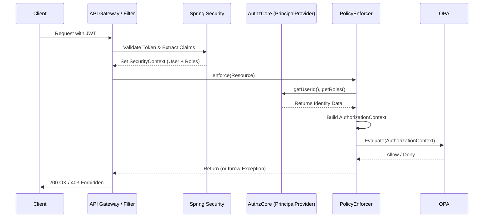

# Security Model and Context Flow

The `authz-core` framework acts as an independent authorization enforcement layer. It does **not** handle authentication (proving *who* the user is). Instead, it relies on the underlying application's security framework (such as Spring Security and Bedrock JWT) to authenticate requests before they reach the `PolicyEnforcer`.

## High-Level Architecture



## The Role of `PrincipalProvider`

The `PrincipalProvider` is the crucial bridge between your authentication system and the `authz-core` policy engine. 

OPA policies (written in Rego) typically require the user's ID and roles to make attribute-based or role-based access control (RBAC) decisions. However, every microservice or framework stores this information differently. 

By default, the framework provides `DefaultPrincipalProvider`, which reads from Spring Security:
```java
public class DefaultPrincipalProvider implements PrincipalProvider {
    @Override
    public String getUserId() {
        return SecurityContextHolder.getContext().getAuthentication().getName();
    }

    @Override
    public List<String> getRoles() {
        // Extracts authorities and strips the "ROLE_" prefix
        // Returns e.g. ["ADMIN", "DOCTOR"]
    }
}
```

### Customizing the Principal Provider

If your application does not use Spring Security, or if you store the roles in a custom thread-local context, you must implement your own `PrincipalProvider`:

```java
@Component
@Primary
public class CustomPrincipalProvider implements PrincipalProvider {
    @Override
    public String getUserId() {
        return MyCustomContext.getCurrentUser().getId();
    }

    @Override
    public List<String> getRoles() {
        return MyCustomContext.getCurrentUser().getRoles();
    }
}
```
The `bedrock-authz-starter` will automatically pick up any `@Primary` bean implementing `PrincipalProvider` and inject it into the `PolicyEnforcer`.

## Authorization Context (`AuthorizationContext`)

Once the identity is extracted, the framework builds an `AuthorizationContext`. This is an engine-agnostic record containing:
1. `userId`: The subject identifier.
2. `roles`: A list of strings representing roles.
3. `permissionCode`: A formatted string combining the namespace, resource, and action (e.g., `pharmacy:prescription:create`).
4. `resourceData`: A map of contextual attributes extracted from the protected resource using `@PolicyField` annotations.

This context is then serialized and sent to the policy engine (OPA) for the final decision.
