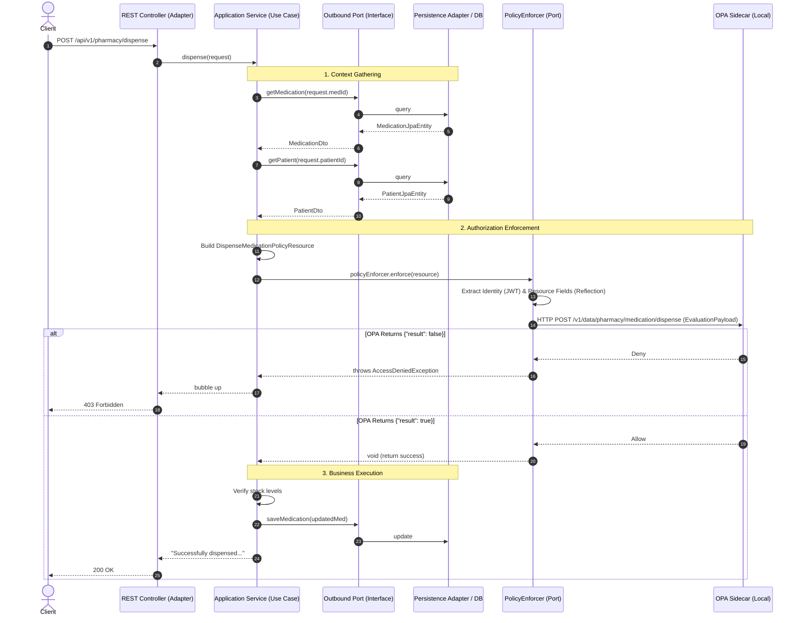
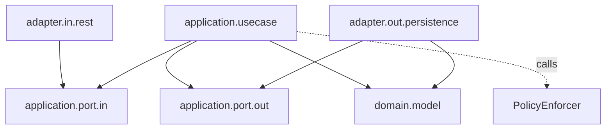

# Architecture & Authorization Guide

This document dives deeper into how Clean Architecture, Hexagonal Architecture, Domain-Driven Design (DDD), and Federated OPA Authorization interconnect in this reference project.

## 1. Architectural Concept Mapping

This table maps theoretical concepts to their concrete implementations in this codebase:

| Concept | Theory / Purpose | Implementation Example |
|---|---|---|
| **Domain Entity** | Core business object, pure Java, ignorant of databases or web frameworks | `domain.model.Doctor` |
| **Inbound Port** | Use Case interface. Defines *what* the system does | `port.in.GetDoctorsUseCase` |
| **Outbound Port** | Interface defining *what* the application needs from the outside world | `port.out.DoctorQueryPort` |
| **Inbound Adapter** | Framework-specific entry point (e.g., REST Controller) | `adapter.in.rest.DoctorController` |
| **Outbound Adapter** | Framework-specific implementation (e.g., Spring Data JPA) | `adapter.out.persistence.adapter.DoctorPersistenceAdapter` |
| **Anti-Corruption Layer** | Mapper converting between Adapter models and Domain models | `adapter.out.persistence.mapper.DoctorJpaMapper` |
| **Application Service** | Orchestrates domain models and ports to execute a use case | `application.service.GetDoctorsService` |

---

## 2. Authorization Flow Sequence

In a decentralized, federated OPA model, the authorization decision happens **locally** within the microservice. The following sequence diagram demonstrates the flow using the **Programmatic Enforcement (Pattern 1)** approach.

### Flow Breakdown

1. **Context Gathering:** The Application layer does NOT rely on the UI/Client to send authorization context (which could be spoofed). Instead, the Application layer queries the database via Outbound Ports to fetch the true state of the requested resources (e.g., patient age, drug class).
2. **Authorization Enforcement:** The Application layer builds a DTO annotated with `@PolicyResource` and `@PolicyField` and passes it to the `PolicyEnforcer`. The Enforcer (an implementation provided by the `authz` library) handles the heavy lifting of extracting the JWT, parsing the annotations, and communicating with the local OPA sidecar.
3. **Business Execution:** Only if `enforce()` succeeds does the application layer proceed to mutate business state.

---

## 3. Package Dependency Rules

To ensure long-term maintainability, strict dependency rules are enforced using **ArchUnit**.

**Golden Rules:**
1. `domain` depends on nothing.
2. `application` depends only on `domain` and library standard abstractions. It must not depend on `adapter` packages.
3. `adapter` packages depend on `application` and `domain`. They implement outbound ports or invoke inbound ports.
