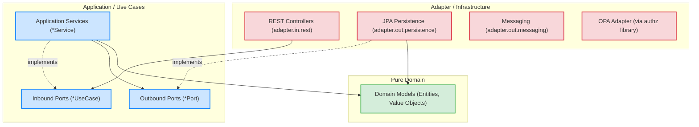

# Pharmacy Microservice (OPA + DDD Reference Implementation)

This project serves as a reference implementation demonstrating how to integrate the **Datamate Federated OPA Authorization Library** within a strict **Clean Architecture**, **Hexagonal Architecture (Ports & Adapters)**, and **Domain-Driven Design (DDD)** codebase.

## 🎯 Project Overview

This sample microservice implements a mock Pharmacy application with use cases like dispensing medication, managing prescriptions, and querying doctors. Its primary goal is to serve as a **learning resource for Pod 2** on how to structure a microservice and correctly enforce authorization policies.

Key concepts demonstrated:
- Decoupling framework (Spring/JPA) from business rules (Domain Layer)
- Using Ports (interfaces) and Adapters (implementations) to inverse dependencies
- Implementing OPA sidecar authorization without polluting the domain model
- Three different OPA authorization enforcement patterns

---

## 🏛️ Architecture Overview

This project adheres to Clean Architecture layered boundaries. Dependencies only ever point **inward** toward the pure domain layer.



> 📖 **Deep Dive:** Read [ARCHITECTURE.md](./ARCHITECTURE.md) for detailed flow sequences and architectural concept mapping.

---

## 🛡️ OPA Authorization Patterns

This project demonstrates three distinct ways to integrate the `authz-core` library's `PolicyEnforcer` into your Clean Architecture workflow.

### Pattern 1: Programmatic ABAC Enforcement (Recommended)
**See:** [`DispenseMedicationService.java`](./src/main/java/org/datamate/pharmacy/application/usecase/DispenseMedicationService.java)
- The application service orchestrates data fetching via outbound ports to build a rich context.
- It instantiates a `@PolicyResource` (e.g., `DispenseMedicationPolicyResource`) and populates its `@PolicyField` properties.
- It explicitly calls `policyEnforcer.enforce(resource)` before mutating state.
- **Why?** It keeps authorization logic extremely explicit and fully decoupled from web frameworks, making it easy to test in isolation.

### Pattern 2: Spring Security `@PreAuthorize` Bridge
**See:** [`CreatePrescriptionService.java`](./src/main/java/org/datamate/pharmacy/application/usecase/CreatePrescriptionService.java)
- Uses Spring Security's `@PreAuthorize` annotation on the service method.
- The SpEL expression delegates to a custom Spring bean: `@PreAuthorize("@prescriptionAuthorizor.prescriptionCreate(#request)")`
- **See:** [`PrescriptionCreatePreAuthorize.java`](./src/main/java/org/datamate/pharmacy/application/usecase/PrescriptionCreatePreAuthorize.java) - The bean fetches the required data and invokes the `PolicyEnforcer`.
- **Why?** Some developers prefer AOP/declarative security. The bridge bean ensures the context gathering logic doesn't pollute the actual business use case.

### Pattern 3: Unconditional / Pure RBAC
**See:** [`ReadPrescriptionService.java`](./src/main/java/org/datamate/pharmacy/application/usecase/ReadPrescriptionService.java)
- The `@PolicyResource` (e.g., `ReadPrescriptionPolicyResource`) has NO `@PolicyField` annotations.
- It simply asserts that the user holds the mapped role (e.g., `PHARMACIST`) to perform the action `read` on `prescription`.
- **Why?** Not all actions require fine-grained attribute-based conditions.

---

## 🏗️ DDD & Clean Architecture Concepts Demonstrated

- **Pure Domain Entities:** `org.datamate.pharmacy.domain.model.Doctor` contains NO `@Entity` or `@Table` annotations. It is a pure POJO.
- **Anti-Corruption Layer (ACL):** `DoctorJpaMapper` translates between the pure `Doctor` domain model and the framework-coupled `DoctorJpaEntity`.
- **Dependency Inversion:** The `GetDoctorsService` (Application Layer) queries data through the `DoctorQueryPort` interface. The `DoctorPersistenceAdapter` (Adapter Layer) implements this port using Spring Data JPA.

---

## 🚀 How to Run Locally

### 1. Prerequisites
- Java 21
- Maven
- Docker & Docker Compose (for RabbitMQ and OPA)

### 2. Start Infrastructure
Start the RabbitMQ instance (shared by the architecture for Subject Sync):
```bash
cd ..
docker-compose up -d
```

### 3. Run the Microservice
```bash
cd pharmacy-microservice
mvn spring-boot:run
```

### 4. Swagger UI
Once running, access the API documentation at:
http://localhost:8080/swagger-ui.html

---

## 🧪 Architecture Verification

This project uses **ArchUnit** to ensure architectural drift does not happen over time. Run the tests to verify constraints:

```bash
mvn test -Dtest=*ArchitectureTest
```

The 3 test suites (`CleanArchitectureTest`, `HexagonalArchitectureTest`, `DddArchitectureTest`) strictly enforce:
- Domain layer independence.
- Correct package naming conventions (`*UseCase`, `*Port`, `*Adapter`).
- Correct placement of persistence implementations vs ports.
